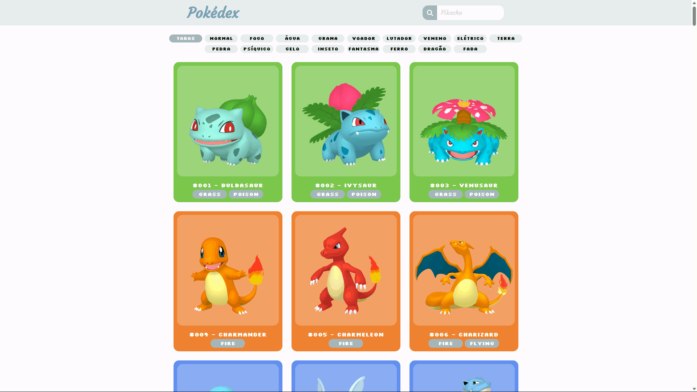

# Pokédex

### [Visitar Projeto](https://pokedex-luiz2k.vercel.app/)

---

## 📝 Sobre
Projeto de uma **Pokédex** feita consumindo a **PokeAPI**, para o consumo dessa API foi utilizado o **Fetch API**. Sempre que houver alguma interação com os card dos Pokémons, irá abrir um modal mostrando mais informações sobre o Pokémon do card interagido, se clicar na estrelinha que está no canto inferior direito da foto do Pokémon no modal, o Pokémon irá mudar de versão. Também é possível buscar um Pokémon especifico pelo seu **NOME** ou **ID** na barra de pesquisa que fica no cabeçalho da página. Os Pokémon também podem ser filtrado pelo seu tipo, basta clicar no botão do tipo do Pokémon que aparece logo no início da página.

## 🛠️ Tecnologias
Projeto desenvolvido utilizando as seguintes tecnologias:
- HTML
- CSS
- JavaScript

---

Projeto desenvolvido por [Luiz Teles](#)
